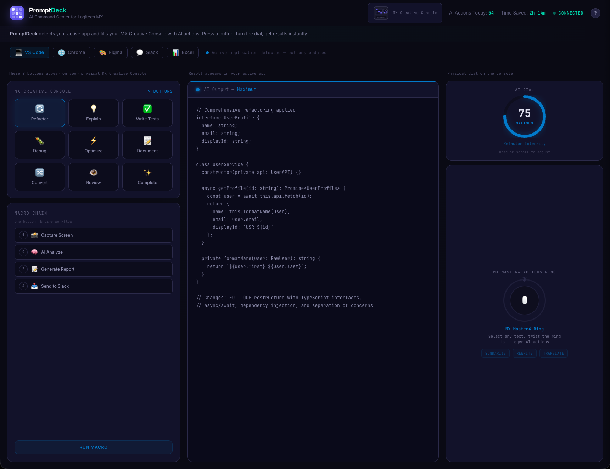
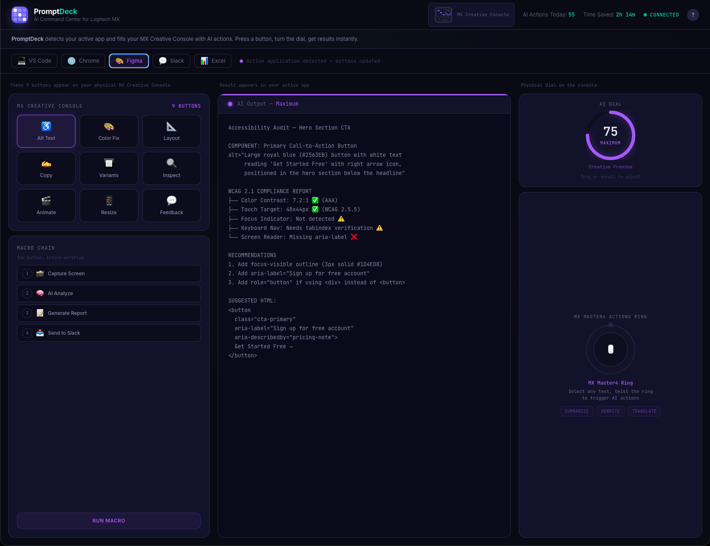
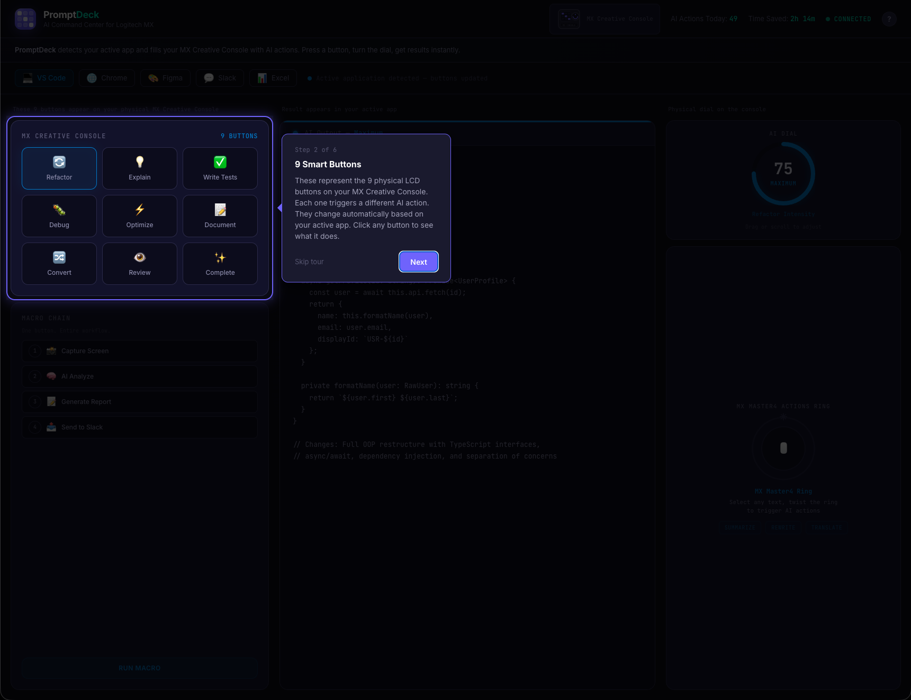
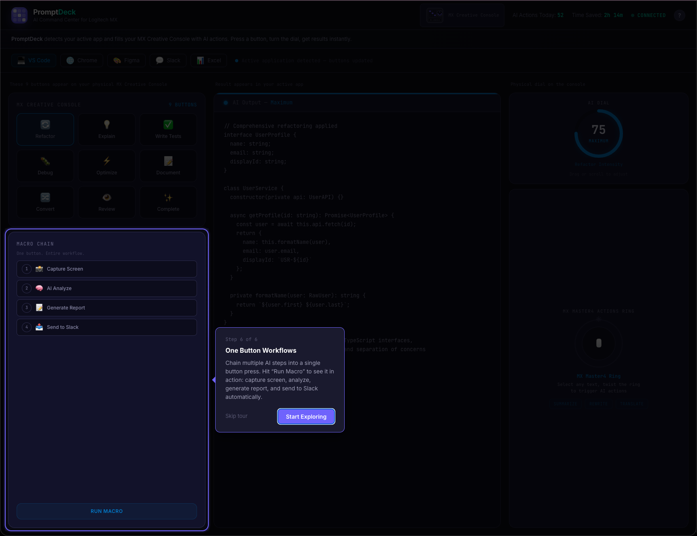

# PromptDeck

**Your AI Command Center for Logitech MX**

Every app on your desktop just got an AI upgrade — at your fingertips.

> Logitech MX Creative Console x MX Master4 Actions Ring x Actions SDK

**[Live Demo](https://dev-studio-hack.vercel.app)**

## Pitch Deck

[View the full pitch (PDF)](public/PromptDeck_Pitch.pdf)

## The Problem

AI is powerful. Using it is painful.

1. **Context Switching** — Leave your app, open ChatGPT, type a prompt, wait, copy the result, paste it back. Every. Single. Time.
2. **No Fine Control** — You can't easily control HOW the AI responds. Want less detail? More creativity? Retype the whole prompt.
3. **Repetitive Workflows** — Same AI tasks repeated dozens of times a day — screenshot, analyze, report — with no way to automate.

## The Solution

PromptDeck transforms your MX Creative Console into a context-aware AI command center that works across every app on your desktop.

### Smart Buttons

9 LCD buttons that dynamically change based on your active app:

| App | Actions |
|---|---|
| **VS Code** | Refactor, Debug, Write Tests, Explain, Optimize, Document, Convert, Review, Complete |
| **Chrome** | Summarize, Translate, Extract, Reply, Cite, Simplify, Compare, Fact Check, Read Aloud |
| **Figma** | Alt Text, Color Fix, Layout, Copy, Variants, Responsive, Annotate, A11y Audit, Export |
| **Slack** | Tone Shift, Standup, Thread Sum, Actions, Template, Translate, Prioritize, Schedule, Digest |
| **Excel** | Formula, Chart, Clean, Analyze, Predict, Pivot, Validate, Merge, Dashboard |

One press. Zero prompts. Instant AI action.

### AI Dial

Turn the physical dial to control AI output depth in real time — from minimal to maximum detail. Continuous analog control that no keyboard shortcut can replicate.

- **MIN (0–33)** — Quick & concise
- **MID (34–66)** — Balanced detail
- **MAX (67–100)** — Comprehensive analysis

### MX Master4 Actions Ring

Select any text or element, twist the ring, get instant AI assistance — summarize, rewrite, or translate with a single gesture.

### One-Press Macro Chains

Chain multi-step AI workflows into a single button press:

1. Capture Screen
2. AI Analyze
3. Generate Report
4. Send to Slack

## Architecture

```
Logi Options+ Profiles → C# Plugin (Actions SDK) → AI Router (Node.js) → AI Models
```

**Tech Stack:** Actions SDK, C# / .NET, WebSocket, Node.js, Claude API

## Demo

This repo contains an interactive web demo built with:

- React 19 + TypeScript
- Vite 6.4
- Tailwind CSS v4

### Run locally

```bash
npm install
npm run dev
```

### Features

- Splash screen with animated loading sequence
- 6-step guided walkthrough tour
- 5 app profiles with 9 unique buttons each (45 AI actions)
- 135 distinct AI output previews (45 buttons x 3 dial levels)
- Interactive AI dial with drag and scroll control
- MX Master4 Actions Ring simulation
- One-press macro chain workflow
- Responsive layout

## Screenshots

| Dashboard (VS Code) | Dashboard (Figma) |
|---|---|
|  |  |

| Walkthrough Tour | Macro Chain |
|---|---|
|  |  |

## License

Built for the Logitech Hackathon 2026.
