<p align="center">
  
</p>

<h1 align="center">PromptDeck</h1>

<p align="center">
  <strong>AI Command Center for Logitech MX</strong><br/>
  Every app on your desktop just got an AI upgrade — at your fingertips.
</p>

<p align="center">
  <a href="https://dev-studio-hack.vercel.app"></a>
  <a href="public/PromptDeck_Pitch.pdf"></a>
</p>

<p align="center">
  
  
  
  
  
</p>

---

## The Problem

AI is powerful. Using it is painful.

| Pain Point | What Happens |
|---|---|
| **Context Switching** | Leave your app → open ChatGPT → type a prompt → wait → copy → paste back. Repeat 30+ times/day. |
| **No Fine Control** | Want less detail? More creativity? Retype the whole prompt. Keyboards are binary — on or off. |
| **Repetitive Workflows** | Screenshot → analyze → report → share. The same multi-step AI tasks, manually, dozens of times daily. |

> Professionals spend **47% of their time** context-switching between tools. AI should reduce this, not add to it.

## The Solution

PromptDeck transforms the **Logitech MX Creative Console** into a context-aware AI command center. No prompts. No tab-switching. Just press, turn, and twist.

| Hardware | What It Does |
|---|---|
| **9 Smart Buttons** | Dynamically show AI actions relevant to your active app. One press = instant AI action. |
| **AI Dial** | Continuous analog control over AI output depth — minimal to maximum. No keyboard equivalent exists. |
| **Actions Ring** | Select anything on screen, twist the MX Master4 ring, get instant AI — summarize, rewrite, translate. |
| **Macro Chains** | Chain multi-step AI workflows into a single button press. |

---

## System Architecture

### High-Level Overview

```mermaid
flowchart TB
    subgraph HW["🎛️ LOGITECH HARDWARE"]
        direction LR
        BTN["9 Smart Buttons<br/><i>MX Creative Console</i>"]
        DIAL["AI Dial<br/><i>Continuous 0–100</i>"]
        RING["Actions Ring<br/><i>MX Master4</i>"]
    end

    subgraph LOGI["⚙️ LOGI OPTIONS+"]
        PROF["Per-App Profiles<br/><i>Auto-switch on app focus</i>"]
    end

    subgraph PLUGIN["🔌 ACTIONS SDK PLUGIN (C#/.NET)"]
        direction LR
        ACTIONS["45 Action Definitions<br/><i>9 per app × 5 apps</i>"]
        DMAP["Dial Mapping<br/><i>Rotate → AI params</i>"]
        RTRIG["Ring Trigger<br/><i>Universal AI invoke</i>"]
    end

    subgraph ROUTER["🧠 AI ROUTER SERVICE (Node.js)"]
        WS["WebSocket Server"]
        ROUTE["Task-Based Routing"]
    end

    subgraph AI["🤖 AI MODELS"]
        direction LR
        CLAUDE["Claude API"]
        OPENAI["OpenAI API"]
        LOCAL["Local LLMs"]
    end

    subgraph OUTPUT["📤 OUTPUT"]
        direction LR
        RESULT["AI Response"]
        DETAIL["Dial-Controlled<br/>Detail Level"]
        MACRO["Macro Chain<br/>Automation"]
    end

    HW --> LOGI
    LOGI --> PLUGIN
    PLUGIN -- "WebSocket" --> ROUTER
    ROUTER --> AI
    AI --> OUTPUT

    style HW fill:#1a1a2e,stroke:#6C63FF,stroke-width:2px,color:#e2e8f0
    style LOGI fill:#1a1a2e,stroke:#fbbf24,stroke-width:2px,color:#e2e8f0
    style PLUGIN fill:#1a1a2e,stroke:#6C63FF,stroke-width:2px,color:#e2e8f0
    style ROUTER fill:#1a1a2e,stroke:#60a5fa,stroke-width:2px,color:#e2e8f0
    style AI fill:#1a1a2e,stroke:#00D4AA,stroke-width:2px,color:#e2e8f0
    style OUTPUT fill:#1a1a2e,stroke:#f472b6,stroke-width:2px,color:#e2e8f0
```



### Data Flow — Button Press to AI Output

```mermaid
sequenceDiagram
    participant User
    participant Console as MX Creative Console
    participant Options as Logi Options+
    participant Plugin as Actions SDK Plugin
    participant Router as AI Router (Node.js)
    participant AI as AI Model

    User->>Console: Presses "Refactor" button
    Console->>Options: Button event
    Options->>Plugin: Action trigger (app=vscode, btn=0)
    Plugin->>Plugin: Read dial value (e.g., 72 → Maximum)
    Plugin->>Router: WebSocket request {action, app, detail_level}
    Router->>AI: Prompt with context + detail constraint
    AI-->>Router: Structured response
    Router-->>Plugin: Formatted result
    Plugin-->>Console: Display on LCD / overlay
    Console-->>User: AI output appears instantly
```



### Interactive Demo — Component Architecture

```mermaid
flowchart TB
    APP["App.tsx<br/><i>Root State Manager</i>"]

    APP --> SPLASH["SplashScreen<br/><i>6-phase boot animation</i>"]
    APP --> WALK["Walkthrough<br/><i>6-step guided tour</i>"]
    APP --> HEADER["Header<br/><i>Logo · Status · Time Saved</i>"]
    APP --> HERO["HeroBanner<br/><i>Value proposition</i>"]
    APP --> SWITCHER["AppSwitcher<br/><i>5 app profiles</i>"]
    APP --> TOAST["ToastContainer<br/><i>Notifications</i>"]

    APP --> COL1["Left Column"]
    APP --> COL2["Center Column"]
    APP --> COL3["Right Column"]

    COL1 --> GRID["ConsoleGrid"]
    GRID --> BTN1["ConsoleButton ×9<br/><i>Hover tooltips</i>"]
    COL1 --> MACRO["MacroChain<br/><i>4-step workflow</i>"]

    COL2 --> OUTPUT["OutputPreview<br/><i>Typewriter effect<br/>375 chars/sec</i>"]

    COL3 --> DIAL["Dial<br/><i>SVG · Drag · Scroll</i>"]
    COL3 --> ARING["ActionsRing<br/><i>Spin animation</i>"]

    subgraph STATE["Centralized State (useState)"]
        S1["activeApp"]
        S2["activeButton"]
        S3["dialValue (0-100)"]
        S4["actionsCount"]
    end

    SWITCHER -.->|"sets"| S1
    BTN1 -.->|"sets"| S2
    DIAL -.->|"sets"| S3
    MACRO -.->|"increments"| S4
    ARING -.->|"increments"| S4

    S1 -.->|"drives"| GRID
    S1 -.->|"drives"| OUTPUT
    S2 -.->|"drives"| OUTPUT
    S3 -.->|"drives"| OUTPUT

    style APP fill:#6C63FF,stroke:#6C63FF,color:#fff
    style STATE fill:#0a0a14,stroke:#00D4AA,stroke-width:2px,color:#e2e8f0
    style COL1 fill:#1a1a2e,stroke:#334155,color:#94a3b8
    style COL2 fill:#1a1a2e,stroke:#334155,color:#94a3b8
    style COL3 fill:#1a1a2e,stroke:#334155,color:#94a3b8
```



### AI Output Resolution — The Dial System

```mermaid
flowchart LR
    subgraph DIAL["AI Dial (0–100)"]
        MIN["🔹 Minimal<br/>0 – 33"]
        MID["🔷 Balanced<br/>34 – 66"]
        MAX["🔶 Maximum<br/>67 – 100"]
    end

    subgraph APPS["× 5 Apps"]
        A1["VS Code"]
        A2["Chrome"]
        A3["Figma"]
        A4["Slack"]
        A5["Excel"]
    end

    subgraph BUTTONS["× 9 Buttons Each"]
        B["45 Unique<br/>AI Actions"]
    end

    subgraph OUTPUTS["= 135 Unique Outputs"]
        O["2,141 Lines<br/>of Domain-Specific<br/>AI Content"]
    end

    DIAL --> APPS
    APPS --> BUTTONS
    BUTTONS --> OUTPUTS

    style DIAL fill:#1a1a2e,stroke:#fbbf24,stroke-width:2px,color:#e2e8f0
    style APPS fill:#1a1a2e,stroke:#6C63FF,stroke-width:2px,color:#e2e8f0
    style BUTTONS fill:#1a1a2e,stroke:#60a5fa,stroke-width:2px,color:#e2e8f0
    style OUTPUTS fill:#1a1a2e,stroke:#00D4AA,stroke-width:2px,color:#e2e8f0
```



---

## App Profiles — 45 AI Actions

Each app gets 9 context-aware buttons that auto-populate when the app is in focus.

| App | Color | Dial Label | 9 Smart Button Actions |
|---|---|---|---|
| **VS Code** | `#007ACC` | Refactor Intensity | Refactor · Debug · Write Tests · Explain · Optimize · Document · Convert · Review · Complete |
| **Chrome** | `#4285F4` | Summary Detail | Summarize · Translate · Extract · Reply · Cite · Simplify · Compare · Fact Check · Read Aloud |
| **Figma** | `#A259FF` | Creative Freedom | Alt Text · Color Fix · Layout · Copy · Variants · Responsive · Annotate · A11y Audit · Export |
| **Slack** | `#E01E5A` | Formality Level | Tone Shift · Standup · Thread Sum · Actions · Template · Translate · Prioritize · Schedule · Digest |
| **Excel** | `#217346` | Analysis Depth | Formula · Chart · Clean · Analyze · Predict · Pivot · Validate · Merge · Dashboard |

> **5 apps** × **9 buttons** × **3 dial levels** = **135 unique AI outputs** — no reused boilerplate.

---

## Screenshots

| Dashboard — VS Code Profile | Dashboard — Figma Profile |
|:---:|:---:|
|  |  |

| Guided Walkthrough | Macro Chain Workflow |
|:---:|:---:|
|  |  |

---

## Getting Started

### Prerequisites

- Node.js 18+
- npm or yarn

### Run Locally

```bash
cd promptdeck-demo
npm install
npm run dev
```

Open [http://localhost:5173](http://localhost:5173) — the splash screen and guided tour will start automatically.

### Build for Production

```bash
npm run build
npm run preview
```

---

## Project Structure

```
promptdeck-demo/
├── src/
│   ├── App.tsx                  # Root component — centralized state management
│   ├── main.tsx                 # React entry point
│   ├── index.css                # Global styles + Tailwind + animations
│   │
│   ├── components/
│   │   ├── Header.tsx           # Top bar with logo, status, time-saved tracker
│   │   ├── HeroBanner.tsx       # Quick value proposition banner
│   │   ├── AppSwitcher.tsx      # 5 app profile selector
│   │   ├── ConsoleGrid.tsx      # 3×3 button grid for active app
│   │   ├── ConsoleButton.tsx    # Individual button with hover/active states
│   │   ├── Dial.tsx             # SVG dial — drag + scroll, 0–100 range
│   │   ├── ActionsRing.tsx      # MX Master4 ring simulator
│   │   ├── OutputPreview.tsx    # Terminal-style AI output with typewriter effect
│   │   ├── MacroChain.tsx       # 4-step macro workflow visualizer
│   │   ├── SplashScreen.tsx     # 6-phase animated boot sequence (3.4s)
│   │   ├── Walkthrough.tsx      # 6-step interactive tour (custom, no library)
│   │   ├── Toast.tsx            # Toast notification container
│   │   ├── Logo.tsx             # Animated logo with diagonal 3×3 grid
│   │   └── ConsoleHardware.tsx  # Hardware connection status
│   │
│   ├── data/
│   │   ├── apps.ts              # 5 app profiles with button configs
│   │   └── outputs/
│   │       ├── vscode.ts        # 9 buttons × 3 levels of AI output
│   │       ├── chrome.ts        # ↳ realistic, domain-specific content
│   │       ├── figma.ts         # ↳ 2,141 lines total across all apps
│   │       ├── slack.ts         # ↳ no lorem ipsum or placeholders
│   │       └── excel.ts         # ↳ actual formulas, code, WCAG tables
│   │
│   └── hooks/
│       └── useToast.ts          # Toast notification hook
│
├── public/                      # Static assets (logo, screenshots, pitch PDF)
├── index.html                   # HTML entry with metadata
├── vite.config.ts               # Vite + React + Tailwind plugins
├── tsconfig.json                # TypeScript strict mode
└── package.json                 # Dependencies
```

---

## Tech Stack

| Layer | Technology | Purpose |
|---|---|---|
| **UI Framework** | React 19 | Component-based UI with hooks |
| **Language** | TypeScript 5.7 | Type safety across the codebase |
| **Bundler** | Vite 6.4 | Fast dev server + optimized builds |
| **Styling** | Tailwind CSS v4 | Utility-first CSS with per-app theming |
| **Hosting** | Vercel | Deployment + analytics |
| **Plugin** | Logi Actions SDK (C#) | Hardware integration layer |
| **Backend** | Node.js + WebSocket | AI request routing |
| **AI** | Claude API / OpenAI | Multi-provider AI model support |

---

## Key Engineering Highlights

- **135 unique AI outputs** — Every button × every dial level has a distinct, domain-specific response. VS Code outputs contain real TypeScript patterns. Excel outputs include regression formulas with R² values.
- **Custom SVG dial** — No library. Pure React + SVG with mousedown/mousemove capture, 0.5x vertical drag sensitivity, 0.3x scroll sensitivity, and CSS transition disabling during drag for zero-lag feedback.
- **Custom walkthrough tour** — 422 lines, no third-party library. Uses CSS `clip-path: polygon(...)` to spotlight elements with a pulsing border and directional tooltip arrows.
- **6-phase splash screen** — Logo spring animation → 3×3 grid dots light sequentially → brand text slides up → progress bar → status text cycles → fade out. 3.4 seconds.
- **Per-app color theming** — Every interactive element shifts color (buttons, dial arc, ring border, macro highlights, output accent, 900px ambient glow) with smooth CSS transitions.
- **Lazy-loaded outputs** — Only VS Code outputs loaded synchronously; Chrome, Figma, Slack, and Excel are dynamically imported for faster initial load.

---

## What's Next

- **More app profiles** — Photoshop, Premiere Pro, Notion, Xcode, Android Studio
- **User customization** — Drag-and-drop AI actions onto the button grid, pick AI models per action
- **On-device learning** — Auto-surface most-used actions, suggest macro chains based on usage patterns
- **Marketplace distribution** — Free plugin with 5 profiles, premium tier for unlimited profiles + team sharing

---

<p align="center">
  Built for the <strong>Logitech Hackathon 2026</strong><br/>
  <sub>MX Creative Console + MX Master4 & Actions Ring: Innovate with the Actions SDK</sub>
</p>
